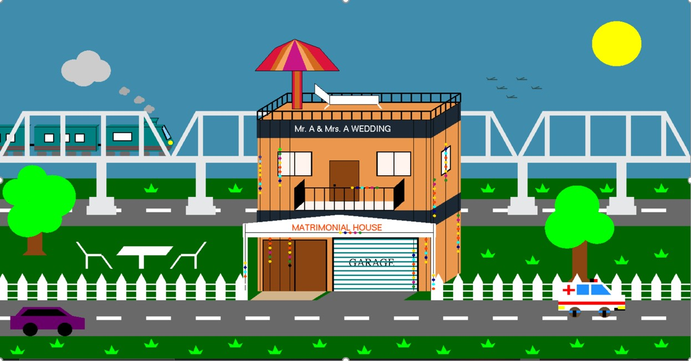
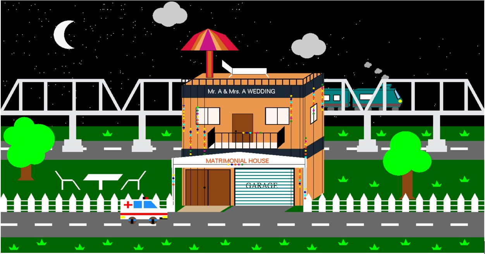

###### Computer-Graphics-Project-Matrimonial-house

### Introduction

In this Project The main purpose was to built matrimonial house view with on of the c++ library OpenGL. In real life, the main attraction point is the decorations and lighting of the house. We tried to bring this view into our project as much as we could do.

### Items

The objects we built in this project those are listed below:

1. House.
2. Garage containing a wedding car.
3. Decoration.
4. Ceremony lights.
5. Arrival Gate.
6. Metro Rail Bridge.
7. Roads.
8. Different types of vehicles.
9. Grass.
10. Trees.
11. Train.
12. Birds.
13. Sun.
14. Moon.
15. Clouds.
16. Stars.
17. Fence.
18. Field.
     
    

There were also some interactions to enhance the beauty of the scenery. Those are-

1. Day Mode.
2. Night Mode.
3. Lighting Effect.
4. Moving Train.
5. Moving Vehicles.
6. Birds Flying.
7. Floating Clouds.
8. Rainy Effect.
9. Sound Effects.
   
