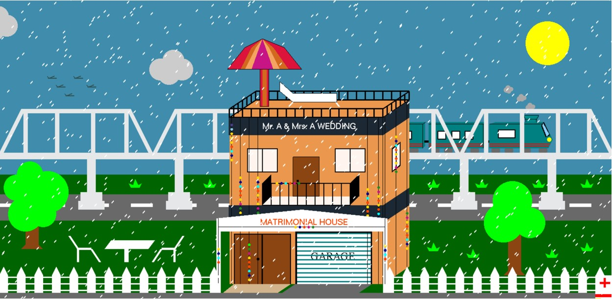

###### Computer-Graphics-Project-Matrimonial-house

### Introduction

In this Project The main purpose was to built matrimonial house view with on of the c++ library OpenGL. In real life, the main attraction point is the decorations and lighting of the house. We tried to bring this view into our project as much as we could do.

### Items

The objects we built in this project those are listed below:

1. House.
2. Garage containing a wedding car.
3. Decoration.
4. Ceremony lights.
5. Arrival Gate.
6. Metro Rail Bridge.
7. Roads.
8. Different types of vehicles.
9. Grass.
10. Trees.
11. Train.
12. Birds.
13. Sun.
14. Moon.
15. Clouds.
16. Stars.
17. Fence.
18. Field.
     
    

There were also some interactions to enhance the beauty of the scenery. Those are-

1. Day Mode.
2. Night Mode.
3. Lighting Effect.
4. Moving Train.
5. Moving Vehicles.
6. Birds Flying.
7. Floating Clouds.
8. Rainy Effect.
9. Sound Effects.
   
    

### Methodolgy

To implement this scenery, we have used different types of geometrical and mathematical shapes. Like, to draw the house we’ve used polygon. Then we’ve used quads to draw the windows of the house, doors, veranda and the garage. The wedding gate was drawn with the help of line and polygon. The lights were in the shape of a circle. To draw the circle we’ve used a function which contains the process. With this, we can draw circles with different radius and this circle is made with polygon. The fence was drawn with the help of polygons and lines. The rail bridge was made with quads and the train over that was made with polygon. The moving of the train was done with the help of translation theory. The body of the tree was made with quads and the leaves were made of circles. The grasses were also made with polygon. The moving cloud and vehicle was also the result of translation. The rain effect was also applied in the project. The switching between the day and night mode was shown by changing background colors with a press of a key. The stars are made of points. The moon is made with two circles side by side and the sun is a single circle.
 

### Significant of the project:

After completing this project, we’ve a basic understanding of the core concepts of computer graphics. Now, we’re capable of using OpenGL to create any kind of interactive computer graphics. We’re able to understand a typical graphics pipeline. Now, we’re capable of generating images with different types of geometrical shapes and animations in our computer. We’re able to demonstrate effective OpenGL programs to solve graphics programming issues including different shapes.
 

 

 

### Controls

